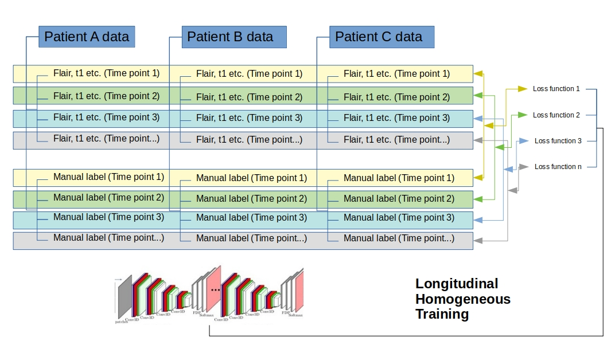
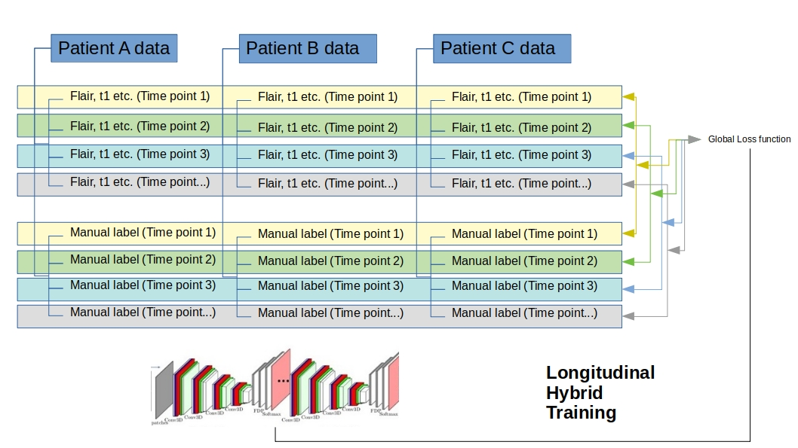
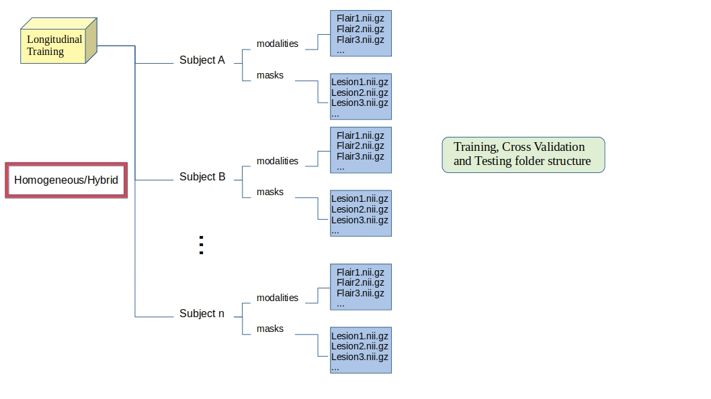
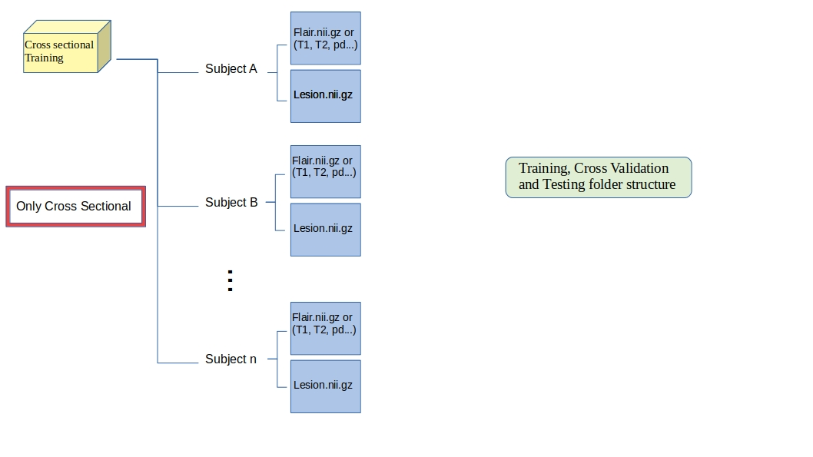
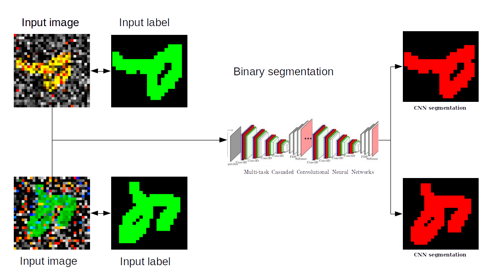

[](https://github.com/kbronik2017/UCL_MS/issues)
[](https://github.com/kbronik2017/UCL_MS/network)
[](https://github.com/kbronik2017/UCL_MS/stargazers)
[](https://github.com/kbronik2017/UCL_MS/blob/master/LICENSE)


# Adaptive Deep Multi-task Learning Framework for Image Segmentation (Cross Sectional and Longitudinal data analysis)


<br>
 
</br>

..................................................................................................................................................................


<br>
 
</br>

# Training/Cross-Validation/Test Data Sets

<br>
 
</br>
<br>
 
</br>

# Running the GUI Program! 

First, user needs to install Anaconda https://www.anaconda.com/

Then


```sh
CPU run
  - conda env create -f cnn_run_conda_environment_cpu.yml 
GPU run
  - conda env create -f cnn_run_conda_environment_gpu.yml 
``` 
and 

```sh
CPU run
  - conda activate idptfcpu
GPU run 
  - conda activate tf-gpu
``` 
finally

```sh
  - python  CNN_Longitudinal_CrossSectional_GUI.py 
``` 

After lunching the graphical user interface, user will need to provide necessary information to start training/testing as follows:  

<br>
 
</br>


# Running the Program from the command line!

First 

```sh
CPU run
  - conda activate idptfcpu
GPU run 
  - conda activate tf-gpu
``` 
then for training


```sh
  - python -m tbb training_script_Cross_Sectional.py  [or training_script_Longitudinal.py]
``` 

for testing

```sh
  - python -m tbb inference_script_Cross_Sectional.py  [or inference_script_Longitudinal.py]
``` 

# Testing the Program!

<br>
 
</br>

